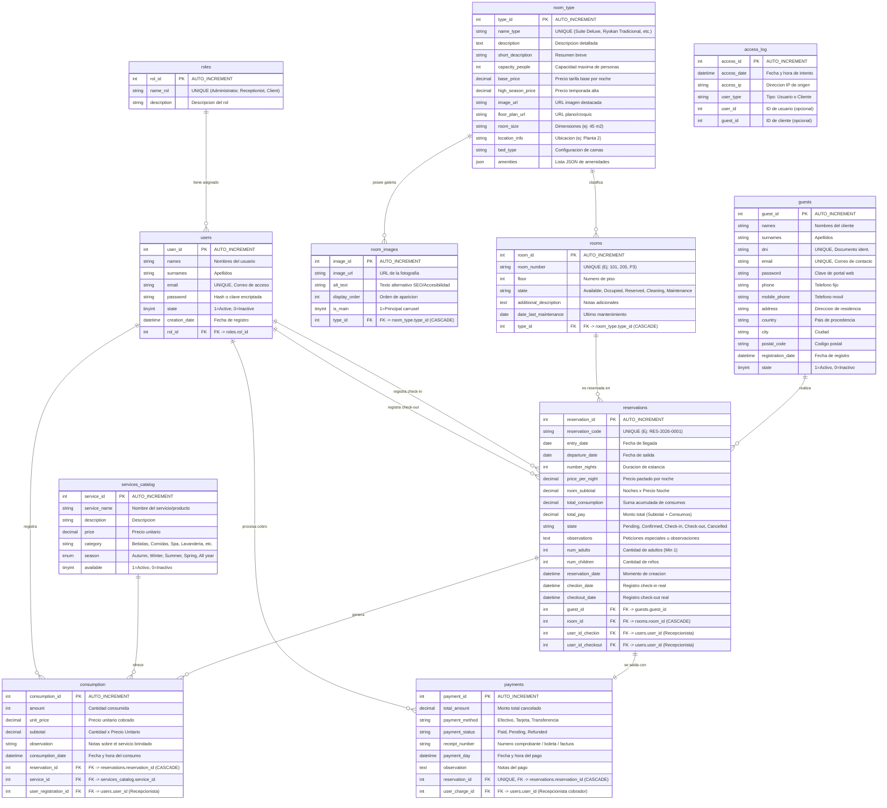

# 🏯 Diagrama Entidad-Relación — DB_Miyabi (Hotel Miyabi)

Documentación oficial del diseño de la base de datos relacional para el sistema de gestión del Ryokan **Hotel Miyabi**.

---

## 📌 1. Visión General del Modelo de Datos

La base de datos `DB_Miyabi` está estructurada en **11 tablas relacionales** organizadas en tres módulos clave:
1. **Gestión de Usuarios, Seguridad y Clientes**: Manejo de roles administrativos (`roles`, `users`), huéspedes registrados (`guests`) y auditoría (`access_log`).
2. **Habitaciones e Inventario**: Tipos de suites (`room_type`), imágenes de carrusel (`room_images`) y habitaciones físicas (`rooms`).
3. **Reservas, Consumos Adicionales y Facturación**: Ciclo de vida de la reserva (`reservations`), catálogo de minibar/spa (`services_catalog`), consumo en habitación (`consumption`) y cobro final (`payments`).

---

## 📐 2. Diagrama Entidad-Relación Completo (Mermaid)

El siguiente gráfico representa el esquema físico relacional completo de la base de datos `DB_Miyabi`.



---

## 🗂️ 3. Diagramas por Módulos del Sistema

### 3.1. Módulo de Habitaciones e Inventario
Administra la definición conceptual de suites (`room_type`), sus recursos multimedia (`room_images`) y la disponibilidad física en tiempo real (`rooms`).

```mermaid
erDiagram
    room_type ||--o{ room_images : "1:N (ON DELETE CASCADE)"
    room_type ||--o{ rooms : "1:N (ON DELETE CASCADE)"

    room_type {
        int type_id PK
        string name_type UNIQUE
        text description
        string short_description
        int capacity_people
        decimal base_price
        decimal high_season_price
        string image_url
        string floor_plan_url
        string room_size
        string location_info
        string bed_type
        json amenities
    }

    room_images {
        int image_id PK
        string image_url
        string alt_text
        int display_order
        tinyint is_main
        int type_id FK
    }

    rooms {
        int room_id PK
        string room_number UNIQUE
        int floor
        string state
        text additional_description
        date date_last_maintenance
        int type_id FK
    }
```

---

### 3.2. Módulo de Usuarios, Seguridad y Control de Acceso
Gestiona la autenticación RBAC para administradores y recepcionistas (`users`), cuentas de huéspedes (`guests`) e historial de auditoría de accesos (`access_log`).

```mermaid
erDiagram
    roles ||--o{ users : "1:N (rol obligatorio)"
    users ||--o{ access_log : "0:N (registro auditoria)"
    guests ||--o{ access_log : "0:N (registro auditoria)"

    roles {
        int rol_id PK
        string name_rol UNIQUE
        string description
    }

    users {
        int user_id PK
        string names
        string surnames
        string email UNIQUE
        string password
        tinyint state
        datetime creation_date
        int rol_id FK
    }

    guests {
        int guest_id PK
        string names
        string surnames
        string dni UNIQUE
        string email UNIQUE
        string password
        string phone
        string mobile_phone
        string address
        string country
        string city
        string postal_code
        datetime registration_date
        tinyint state
    }

    access_log {
        int access_id PK
        datetime access_date
        string access_ip
        string user_type
        int user_id
        int guest_id
    }
```

---

### 3.3. Módulo de Reservas, Consumos y Pagos
Modela el flujo completo desde la reserva web, adición de servicios (comidas, spa, traslados) hasta el check-out y liquidación final.

```mermaid
erDiagram
    guests ||--o{ reservations : "1:N (un cliente tiene varias reservas)"
    rooms ||--o{ reservations : "1:N (una habitacion aloja multiples reservas a lo largo del tiempo)"
    users ||--o{ reservations : "0:N (recepcionista check-in)"
    users ||--o{ reservations : "0:N (recepcionista check-out)"
    reservations ||--o{ consumption : "1:N (ON DELETE CASCADE)"
    services_catalog ||--o{ consumption : "1:N (servicio consumido)"
    users ||--o{ consumption : "0:N (recepcionista que anoto consumo)"
    reservations ||--|| payments : "1:1 (UNIQUE, ON DELETE CASCADE)"
    users ||--o{ payments : "0:N (recepcionista que cobro)"

    reservations {
        int reservation_id PK
        string reservation_code UNIQUE
        date entry_date
        date departure_date
        int number_nights
        decimal price_per_night
        decimal room_subtotal
        decimal total_consumption
        decimal total_pay
        string state
        int num_adults
        int num_children
        int guest_id FK
        int room_id FK
        int user_id_checkin FK
        int user_id_checkout FK
    }

    services_catalog {
        int service_id PK
        string service_name
        decimal price
        string category
        enum season
        tinyint available
    }

    consumption {
        int consumption_id PK
        int amount
        decimal unit_price
        decimal subtotal
        datetime consumption_date
        int reservation_id FK
        int service_id FK
        int user_registration_id FK
    }

    payments {
        int payment_id PK
        decimal total_amount
        string payment_method
        string payment_status
        string receipt_number
        datetime payment_day
        int reservation_id FK
        int user_charge_id FK
    }
```

---

## 📑 4. Diccionario de Tablas y Restricciones Principales

| Tabla | Clave Primaria | Claves Foráneas (FK) | Restricciones / Constraints Principales |
| :--- | :--- | :--- | :--- |
| **`roles`** | `rol_id` | N/A | `name_rol` UNIQUE |
| **`users`** | `user_id` | `rol_id` -> `roles(rol_id)` | `email` UNIQUE |
| **`guests`** | `guest_id` | N/A | `dni` UNIQUE, `email` UNIQUE |
| **`room_type`** | `type_id` | N/A | `name_type` UNIQUE |
| **`room_images`** | `image_id` | `type_id` -> `room_type(type_id)` | `ON DELETE CASCADE` |
| **`rooms`** | `room_id` | `type_id` -> `room_type(type_id)` | `room_number` UNIQUE, `ON DELETE CASCADE` |
| **`reservations`** | `reservation_id` | `guest_id`, `room_id`, `user_id_checkin`, `user_id_checkout` | `CHECK (num_adults + num_children <= 6)`, `CHECK (num_adults >= 1)` |
| **`services_catalog`**| `service_id` | N/A | `season` ENUM('Autumn','Winter','Summer','Spring','All year') |
| **`consumption`** | `consumption_id` | `reservation_id`, `service_id`, `user_registration_id` | `ON DELETE CASCADE` en `reservation_id` |
| **`payments`** | `payment_id` | `reservation_id` (UNIQUE), `user_charge_id` | 1 a 1 con `reservations`, `ON DELETE CASCADE` |
| **`access_log`** | `access_id` | N/A | Logs de IP y tipo de usuario |

---

## 🛠️ 5. Archivos de Diagramas en el Proyecto

Los diagramas fuente están disponibles en formato `.mmd` independiente dentro del directorio `docs/diagrams/`:
- [database_er_full.mmd](file:///home/kaos/Repos/Miyabi/docs/diagrams/database_er_full.mmd) — Diagrama ER completo de la base de datos.
- [module_rooms.mmd](file:///home/kaos/Repos/Miyabi/docs/diagrams/module_rooms.mmd) — Módulo de Habitaciones e Inventario.
- [module_users_roles.mmd](file:///home/kaos/Repos/Miyabi/docs/diagrams/module_users_roles.mmd) — Módulo de Usuarios, Roles y Seguridad.
- [module_reservations_billing.mmd](file:///home/kaos/Repos/Miyabi/docs/diagrams/module_reservations_billing.mmd) — Módulo de Reservas y Facturación.
- [viewer.html](file:///home/kaos/Repos/Miyabi/docs/diagrams/viewer.html) — Visor web interactivo para abrir en navegador.
